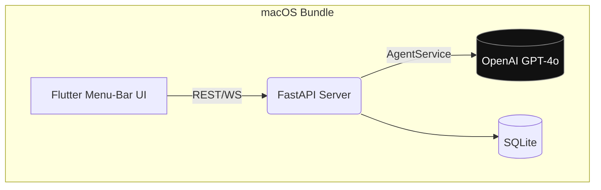
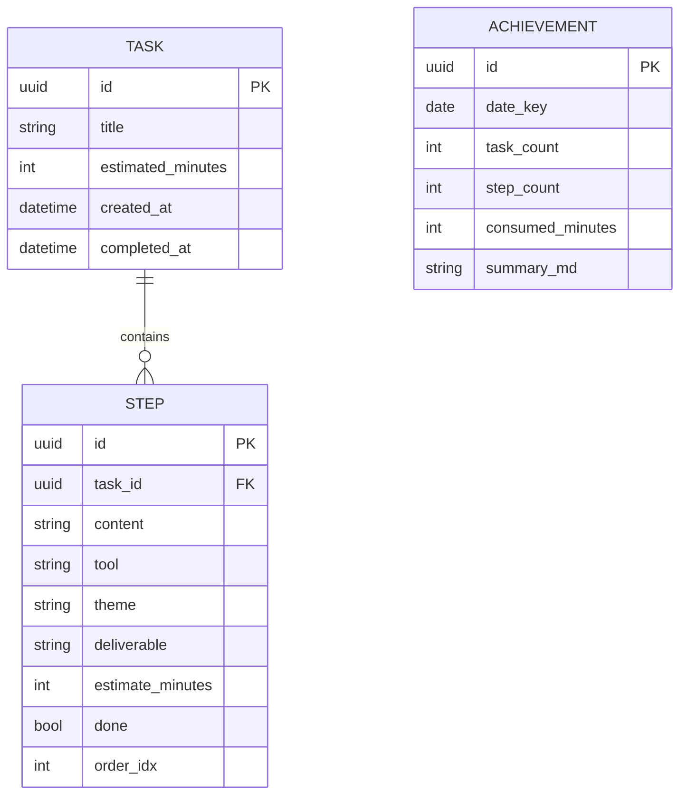
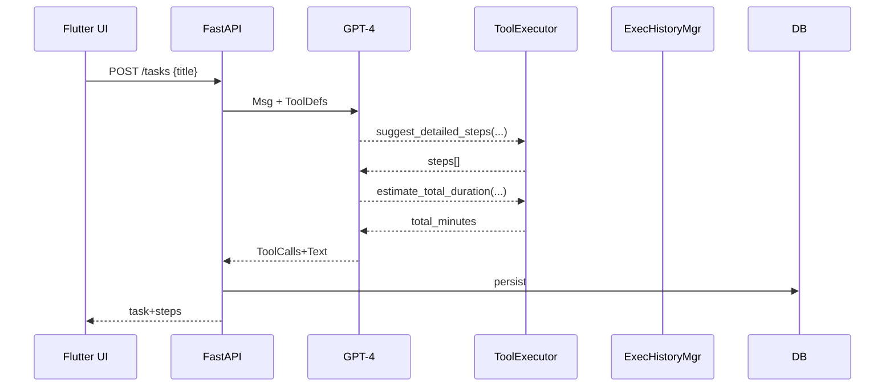

````markdown
# 🦄 **Task-Agent macOS Menu-Bar App**

_Full Technical & API Documentation – v1.0 (2025-07-25)_

---

## 0. Table of Contents

1. Product Vision & Tech-Stack
2. End-to-End System Architecture
3. Data Contracts & Storage Layer
4. Back-end (Python/FastAPI) Design
5. Agent Layer (OpenAI GPT-4 Tool-Calling)
6. Front-end (Flutter/macos) Design
7. Public API Specification
8. Security, Rate-Limit & Observability
9. Local Packaging & CI/CD
10. Roadmap

---

## 1. Product Vision & Tech-Stack

| Tier      | Technology                                                                 |
| --------- | -------------------------------------------------------------------------- |
| Front-end | Flutter 3.24 (macOS target, Impeller)                                      |
| Back-end  | Python 3.11 + FastAPI + Uvicorn                                            |
| Database  | SQLite (local bundle) / SQLModel ORM                                       |
| Agent     | OpenAI GPT-4o-mini (function-calling)                                      |
| State     | Flutter Bloc (Presentation) + REST/WS                                      |
| Testing   | pytest, coverage, Flutter test                                             |
| Packaging | macOS `.app` via `flutter build macos`, Python packaged with `pyinstaller` |

---

## 2. End-to-End System Architecture


````

Flow:

1. User enters a task in menu-bar → FE `POST /tasks`.
2. BE persists skeleton, calls **AgentService** to auto-decompose.
3. Steps returned → FE renders; user checks them off (WS push).
4. Upon completion FE `POST /tasks/{id}/complete` → BE generates summary via LLM and saves daily achievement.

---

## 3. Data Contracts & Storage



All persisted locally in `~/Library/Application Support/TaskAgent/task.db`.

---

## 4. Back-end (Python/FastAPI)

### 4.1 Folder Layout

```
backend/
 ├─ main.py              # FastAPI bootstrap
 ├─ models.py            # SQLModel ORM entities
 ├─ schemas.py           # Pydantic DTOs
 ├─ services/
 │    ├─ task.py
 │    ├─ summary.py
 │    └─ agent.py
 ├─ api/
 │    ├─ tasks.py
 │    ├─ summaries.py
 │    └─ achievements.py
 ├─ utils/
 └─ tests/
```

### 4.2 Core Services

| Service        | Key Methods                                                                 |
| -------------- | --------------------------------------------------------------------------- |
| `TaskService`  | `create(title)`, `mark_step_done(step_id)`, `complete(task_id)`             |
| `AgentService` | `suggest_steps(title)`, `estimate_total(steps)`, `compose_summary(task_id)` |
| `SummarySvc`   | `daily(date)`, `save(task_id, md)`                                          |
| `AchieveSvc`   | `rollup(date)` (cron after 23:59)                                           |

Uvicorn command:

```bash
uvicorn backend.main:app --port 8123 --host 127.0.0.1
```

---

## 5. Agent Layer (OpenAI)

### 5.1 Tool Definitions

```jsonc
[
  {
    "name": "suggest_detailed_steps",
    "description": "生成任务拆解",
    "parameters": {
      "type": "object",
      "properties": { "task_title": { "type": "string" } },
      "required": ["task_title"]
    }
  },
  {
    "name": "estimate_total_duration",
    "description": "计算总时长", ...
  },
  {
    "name": "compose_task_summary",
    "description": "任务完成后生成总结", ...
  }
]
```

### 5.2 Execution Flow



### 5.3 Python Snippet

```python
from openai import OpenAI
client = OpenAI(api_key=os.getenv("OPENAI_API_KEY"))
completion = client.chat.completions.create(
    model="gpt-4o-mini",
    tools=TOOL_DEFS,
    messages=history
)
```

---

## 6. Front-end (Flutter)

| Layer       | Tech                                        |
| ----------- | ------------------------------------------- |
| UI          | `macos_ui`, `flutter_bloc`                  |
| HTTP        | `dio`                                       |
| WebSocket   | `web_socket_channel`                        |
| Local Prefs | `shared_preferences` (OpenAI key path etc.) |

### 6.1 Bloc Events → API Mapping

| Bloc Event     | HTTP                     | Response Handling  |
| -------------- | ------------------------ | ------------------ |
| `CreateTask`   | POST /tasks              | emits `TaskLoaded` |
| `ToggleStep`   | PATCH /tasks/{}/steps/{} | WS push updates    |
| `CompleteTask` | POST /tasks/{}/complete  | show SummaryPage   |

---

## 7. Public REST & WS API

Base URL `http://127.0.0.1:8123/api/v1`

### 7.1 Endpoints

| Verb  | Path                     | Body              | Resp               | Description    |
| ----- | ------------------------ | ----------------- | ------------------ | -------------- |
| POST  | /tasks                   | {title}           | Task+Steps         | 新建并自动拆解 |
| GET   | /tasks/{tid}             | -                 | Task+Steps         | 查询           |
| PATCH | /tasks/{tid}             | {title?}          | Task               | 更新标题       |
| PATCH | /tasks/{tid}/steps/{sid} | {done?, content?} | Step               | 更新步骤       |
| POST  | /tasks/{tid}/complete    | -                 | {summary_markdown} | 完成 & 总结    |
| GET   | /summary/today           | -                 | {summary_markdown} | 今日汇总       |
| GET   | /achievements            | ?page             | Achv[]             | 列表           |
| GET   | /achievements/{id}       | -                 | Achv               | 详情           |
| GET   | /tools                   | -                 | ToolDefs           | debugging      |
| WS    | /ws/progress             | -                 | Step events        | 推送实时进度   |

### 7.2 Schema Example – Step

```json
{
  "id": "b3fb…",
  "content": "浏览近期LLM新闻",
  "tool": "Chrome / Google Scholar",
  "theme": "资料收集",
  "deliverable": "refs.md",
  "estimate_minutes": 25,
  "done": false,
  "order_idx": 0
}
```

---

## 8. Security & Observability

- OpenAI key stored in macOS Keychain → injected as env `OPENAI_API_KEY`.
- FastAPI middleware:
  - `RateLimiter`: 60 req/min.
  - `AuthHeader` (future).
- Logging: `structlog`, file at `~/Library/Logs/TaskAgent/backend.log`.
- Telemetry: optional Sentry DSN.

---

## 9. Packaging & CI/CD

1. **Python**
   ```bash
   pip install -r requirements.txt
   pyinstaller --onefile backend/main.py -n taskagentd
   ```
2. **Flutter**

   ```bash
   flutter build macos --release
   ```

   Copy `taskagentd` into `Runner.app/Contents/MacOS/`.

3. **Codesign & Notarize** (Apple):

   ```
   codesign --deep --sign "Developer ID …" Runner.app
   xcrun notarytool submit Runner.app --apple-id …
   ```

4. **GitHub Actions** workflow:
   - lint → test → build backend → build flutter → release artifact `.dmg`.

---

## 10. Roadmap

- iCloud / Supabase sync.
- Natural-language progress updates (“我完成了收集资料”).
- Badge system & social share.
- Offline local LLM (Mistral-tiny) fallback.

---

© 2025 Task-Agent Team

```

```
